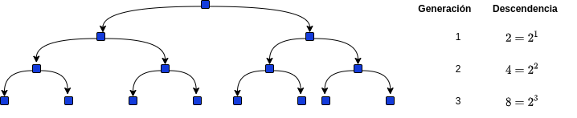

<!-- marp .\01_introduccion.md -o .\01_introduccion.pdf --allow-local-files --html=true -->

<!-- marp .\03_demostraciones_e_induccion.md --html=true -p -o .\03_demostraciones_e_induccion.html -->
<!-- headingDivider: 3 -->

### .: Demostraciones e Inducción :.

#### EST-1132
##### Estructuras Discretas
##### Primer semestre 2022

**Juan Zamora O.**
juan.zamora@pucv.cl

# Demostraciones

- Anteriormente, consideramos argumentos de la forma $P\Rightarrow Q$
- El objetivo consistía en probar que el argumento era universalmente verdadero para todas las interpretaciones
- Introduciremos una noción de contexto que delimitará un ámbito para la validez de un argumento (generalmente $\mathbb{Z}^+$ o $\mathbb{N}$)
- Así usaremos un mecanismo que nos permita probar que si $P$ es verdadero en un cierto contexto, entonces también lo será $Q$. Luego, $P\Rightarrow Q$ se transforma en un teorema dentro de ese ámbito.

# Tipos de Razonamiento
<!-- seccion 2.1 de Gersting ugeda para lectua -->
- Razonamiento deductivo (Top-Down)
	- Comienzan con premisas que llevan o derivan una conclusión

- Razonamiento inductivo (Bottom-up)
	- Premisa particular y generalización repetitiva
	- Conclusiones se obtienen a partir de observaciones sucesivas

# El método de Inducción

**Objetivos**

1. Reconocer cuando es apropiada una prueba por este método
1. Probar conjeturas
1. Probar matemáticamente la correctitud de programas que usan sentencias repetitivas `For`

## Ejemplo de los escalones

* Imagine que está subiendo una escalera infinitamente larga.
* ¿Como saber si será posible alcanzar un escalón arbitrariamente alto?
* Suponga que realizamos las siguientes afirmaciones:
	1. [A1] Es posible alcanzar el primer escalón (el más bajo).
	1. [A2] Al alcanzar un escalón, siempre podrás alcanzar el que está inmediatamente más arriba.

---

- Si ambas afirmaciones son ciertas, entonces será posible alcanzar el primer escalón y por lo tanto (usando A2) también el segundo, (nuevamente A2) el tercero ...
- Si sólo A1 es cierto, no existiría garantía de subir más allá
- Si sólo A2 es cierto, no habría garantía siquiera de poder comenzar a subir

## Principio del buen orden

- Dados dos enteros diferentes $x$, $y$, se sabe que $x<y$ o $y<x$
	- Esto es cierto también para los racionales y los reales
- ¿Qué hace especial a $\mathbb{Z}$ y su subconjunto $\mathbb{Z}^+$?
  - $\mathbb{Z}^+=\{x\in\mathbb{Z}|x>0\}=\{x\in\mathbb{Z}|x\geq 1\}$
- No podemos establecer la misma definicion para los racionales y los reales
- Todo subconjunto no vacío $X$ de $\mathbb{Z}^
+$ contiene un entero $a\in X | a\leq x, \forall x\in X$ denominado mínimo 

---

**El principio del buen orden**

Cualquier subconjunto no vacío de $\mathbb{Z}^
+$ contiene elemento mínimo.

- Esto es la base de la Inducción matemática

## El primer principio de inducción matemática

- Los escalones del ejemplo anterior se encuentran numerados por enteros positivos $1,2,3\ldots$
- En lugar de *"alcanzar un escalón arbitrariamente alto"* usaremos otra propiedad arbitraria $P$  sobre los números positivos
- Necesitamos entonces probar que
$$
\begin{array}{llr}
   1.& P(1)  & \mbox{1 tiene la propiedad $P$}\\
   2.& \forall k\in\mathbb{Z}^+ [P(k)\Rightarrow P(k+1)]             & \mbox{Si un numero cualquiera la cumple, tambien el sgte.}
\end{array}   
$$

---

- **Estrategia:** Mostrar que ambas hipotesis son ciertas
- La primera es trivial (**paso base**)
- La segunda es una implicancia que debe cumplirse para cualquier $k$ (**paso inductivo**)
- Luego usamos G.U. 
- Útil cuando se desea probar que algo se cumple para cada entero positivo

**
Inducción matemática se usa solamente para confirmar una conjetura que es correcta
**

### Ejemplo Descendencia

	 

- Ser vivo K tuvo dos hijos. Cada uno de estos (1ra generación) tuvo otros dos. Luego, pasó lo mismo en la 3ra generación. Así sucesivamente ...
- Al parecer, la generación $n$-ésima contiene $2^n$ individuos. **Probar**!

---
<!-- @auto-scaling math-->
<!-- https://www.webfx.com/tools/emoji-cheat-sheet/ -->
1) *Paso base*: $P(1)=2^1$ :metal:
2) Ahora supongamos que la conjetura es correcta para un $k\geq 1$ cualquiera. Esto es  $P(k)=2^k$
3) Intentemos demostrar que $P(k+1)=2^{k+1}$ :smiley_cat:
4) Consideremos el **hecho** de que en esta familia, cada descendiente tiene siempre 2 hijos.
	- Entonces, $P(k+1)=2\times P(k)$
5) Luego, usando el supuesto inductivo $P(k)=2^k$, entonces $P(k+1)=2\times P(k)=2\times (2^k)=2^{k+1}$
6) Por lo tanto, logramos demostrar el punto (3) para cualquier valor de $k$. :muscle:

### Síntesis del primer principio de inducción

- **Paso 1** Demostrar el caso base.
- **Paso 2** Suponer $P(k)$.
- **Paso 3** Demostrar $P(k+1)$.

## El segundo principio de inducción matemática

$$
\begin{array}{llr}
   1.& P(1)  & \mbox{es verdadero}\\
   2.& \forall k\in\mathbb{Z}^+ [\forall 1\leq r \leq k\ , P(r)\Rightarrow P(k+1)]  & \mbox{Se usa $P(1),P(2)\ldots P(k)$}
\end{array}   
$$

Luego que se demuestra $P(k+1)$ usando la base inductiva y la hipótesis inductiva, se generaliza para cualquier valor $n$.

- Es posible demostrar que ambos principios de inducción son equivalentes.
- En ocasiones es más conveniente usar uno o el otro.

### Ejemplo Factorización de números primos

Demostrar que para cada número entero $n\geq 2$ es primo o bien se compone del producto de números primos.

$$
\begin{array}{lll}
   1.& P(2)  & \mbox{claramente es verdadero}\\
   2.& P(2),P(3),\ldots ,P(n)  & \mbox{\textbf{hipotesis} inductiva}\\
   3.& P(n+1)			& \mbox{Paso inductivo (demostrar usando 1y 2)}
\end{array}   
$$

* ¿Porque no usar el primer principio de inducción?
* Dificil relacionar $P(k)$ con $P(k+1)$

---

¿Como realizar el Paso Inductivo?

- Considerar $(k+1)$ y el caso en que sea primo ... estamos ok!
- El caso que nos interesa es cuando $(k+1)$ **no** es primo.
	- Entonces $(k+1)$ es compuesto y puede ser escrito como $(k+1)=a\cdot b$ con $1< a,b <(k+1)$
	- Según Hipotesis inductiva, contamos entonces con $P(a)$ y $P(b)$
	- Luego, $a$ y $b$ son primos o bien están compuestos por primos.
	- Entonces, para cualquier caso $(k+1)$ es un producto de primos. 
	- Se demuestra $P(k+1)$

### Teorema Fundamental de la Aritmética

- La afirmación recien demostrada constituye el **teorema fundamental de la aritmética**

Para cada entero $n\geq 2$, $n$ es un primo o bien puede ser escrito de manera única (ignorando orden) como producto de números primos.  

### Síntesis del segundo principio de inducción

- La demostración del Ejemplo anterior es de **existencia**
- En general, no es sencillo encontrar la factorización de números primos para un número compuesto

