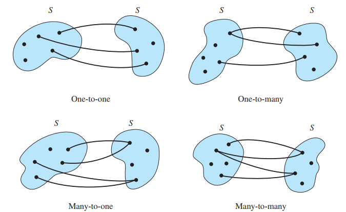
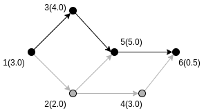
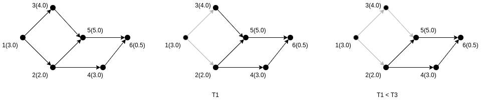
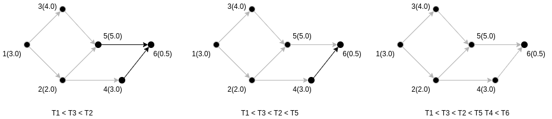

<!-- marp .\01_introduccion.md -o .\01_introduccion.pdf --allow-local-files --html=true -->
<!-- marp .\04_recursion.md --html=true -p -o .\04_recursion.html --bespoke.progress -c .\marp.config.js  -->

<!-- headingDivider: 3 -->

### .: Relaciones Binarias :.

#### EST-1132
##### Estructuras Discretas
##### Primer semestre 2022

**Juan Zamora O.**
juan.zamora@pucv.cl

# Introducción

Estudiaremos 
* relaciones entre **pares** de individuos de un conjunto
* Propiedades de estas relaciones
    - Ejemplos: *Orden Parcial* y *Equivalencia*
* Lo aprendido en esta unidad tiene aplicaciones en la optimización de procesos y bases de datos por mencionar dos áreas.

# Relaciones binarias

- Recordemos la idea de pares de elementos de un conjunto
- **Por ejemplo:** Dado $S=\{1,2,3\}$, 
  
  $$S\times S=\{(1,1),(1,2),(1,3),(2,1),(2,2),(2,3),(3,1),(3,2),(3,3)\}$$
- Podemos definir ciertas condiciones entre elementos de $S$
    - Ej. Elementos iguales, un número menor que el otro, un número divide al otro ...
- Podemos simbolizar uno de estos criterios mediante la letra $\rho$

---

- Este criterio o relación puede ser definida en palabras o como una ecuación
- Luego, $x\rho y$ indica que el par ordenado $(x,y)$ satisface la condición impuesta por la relación
- Aún podemos formalizar de mejor manera esta definición.

## Relación Binaria sobre un conjunto S
- Es un subconjunto de $S\times S$
- Entonces 
$$x\rho y \Leftrightarrow (x,y)\in \rho$$

- Por ejemplo, dado $S=\{1,2,4\}$, y la relación $x\rho y\Leftrightarrow x=\frac{y}{2}$  
    - Entonces, $(1,2)$ y $(2,4)$ satisfacen $\rho$.

### Ejemplo

1. Dado $S=\{1,2\}$ y sea $\rho$ definida sobre $S$ como $x\rho y\Leftrightarrow x+y$ es impar. ¿Cuales pares ordenados satisfacen la relación?

- Consideremos primero $S\times S=\{(1,1),(1,2),(2,1),(2,2),\}$
- $1\rho 1 = 2\Rightarrow$ **No** cumple
- $1\rho 2 = 3\Rightarrow$ **Sí** cumple
- $2\rho 1 = 3\Rightarrow$ **Sí** cumple
- $2\rho 2 = 4\Rightarrow$ **No** cumple

Entonces $\rho=\{(1,2),(2,1)\}$

## Relaciones binarias sobre conjuntos distintos

- Las relaciones binarias no son exclusivas de conjuntos $S\times S$
- También es posible definirlas, por ejemplo sobre $S=\{1,2,3\}$ y $T=\{2,4,7\}$
    - En este caso, una relación binaria de $S$ a $T$ es un subconjunto de $S\times T$ 

**Generalización** Una relación $n$-aria se define de igual manera sobre $n$ conjuntos. Es decir $S_1\times S_2\times\ldots S_n$

## Ejercicios

Para cada una de las relaciones binarias $\rho$ sobre $\mathbb{N}$, indique cuales pares ordenados pertenecen.
1. $x\rho y\Leftrightarrow x=y+1;(2,2)(2,3)(3,3)(3,2)$
1. $x\rho y\Leftrightarrow x\mbox{ divide }y;(2,4)(2,5)(2,6)$
1. $x\rho y\Leftrightarrow x\mbox{ es impar };(2,3)(3,4)(4,5),(5,6)$
1. $x\rho y\Leftrightarrow x>y^2;(1,2)(2,1)(5,2),(6,4),(4,3)$

# Tipos de relaciones

- Una relación $\rho$ sobre $S$ consistirá de un conjunto de pares ordenados de la forma $(s_1,s_2)$.
- Existen varias maneras de parear los elementos de $S$ en la relación
- Si cada $s_1$ y cada $s_2$ aparecen solo una vez en la relación: **Uno a Uno**
- Si algun(os) $s_1$ aparece con más de un $s_2$ distinto: **Uno a Muchos**
- Si algun(os) $s_2$ aparece con más de un $s_1$ distinto: **Muchos a Uno**
- Si al menos un $s_1$ es pareado con más de un $s_2$ distinto y viceversa: **Muchos a Muchos**

---

 

(figura extraída del Gersting, cap 5.1)

## Ejercicios

Identifique el tipo de relación sobre $S=\{2,5,7,9\}$ como uno a uno, uno a muchos ...
1. $\{(5,2),(7,5),(9,2)\}$
2. $\{(2,5),(5,7),(7,2)\}$ 
3. $\{(7,9),(2,5),(9,9),(2,7)\}$

# Operaciones sobre relaciones

- Considerar todas las relaciones binarias sobre $S$
- Si $\rho$ y $\sigma$ pertenecen a este conjunto de relaciones entonces son subconjuntos de $S\times S$
- Luego, es posible aplicar operaciones de conjuntos  (unión, intersección y complemento) entre estas relaciones y obtener nuevas

$$
\begin{array}{rcl}
   x(\rho\cup \sigma)y& \Leftrightarrow& x\rho y\ \lor \ x\sigma y  \\
   x(\rho\cap \sigma)y &\Leftrightarrow& x\rho y\ \land\ x\sigma y  \\
   x(\rho') y& \Leftrightarrow& \neg\ x\rho y    
\end{array}
$$

### Ejercicios

Sean $\rho$ y $\sigma$ dos relaciones binarias sobre $\mathbb{N}$ definidas como
- $x\ \rho\ y\Leftrightarrow x=y$
- $x\ \sigma\ y\Leftrightarrow x < y$

Entregue una descripción verbal para 

1. $\rho \cup \sigma$
1. $\rho'$
1. $\sigma'$

# Propiedades de las relaciones

Una relación binaria $\rho$ sobre un conjunto $S$ puede tener ciertas propiedades
- **Reflexibidad** $(\forall x)(x\in S\Rightarrow (x,x)\in \rho)$
- **Simetría** $(\forall x)(\forall y)(x\in S\land y\in S\land(x,y)\in \rho\Rightarrow (y,x)\in \rho)$
- **Transitividad** 
$$(\forall x)(\forall y)(\forall z)(x\in S\land y\in S\land z\in S\land (x,y)\in\rho\land(y,z)\in\rho\Rightarrow (x,z)\in \rho)$$
- **Antisimetría** $(\forall x)(\forall y)(x\in S\land y\in S\land(x,y)\in \rho\land (y,x)\in\rho\Rightarrow x=y)$

## Ejemplos

- Identifique qué propiedades cumple $=$ sobre $\mathbb{N}$
- Identifique qué propiedades cumple $\leq$ sobre $\mathbb{N}$
- Identifique qué propiedades cumple $\subseteq$ sobre $\wp(\mathbb{N})$

## Ejemplos (respuestas)

- Identifique qué propiedades cumple $=$ sobre $\mathbb{N}$
    - $x\rho y\Leftrightarrow x= y$ es reflexiva, transitiva y simetrica
- Identifique qué propiedades cumple $\leq$ sobre $\mathbb{N}$
    - $x\rho y\Leftrightarrow x\leq y$ es reflexiva, transitiva y  antisimetrica
- Identifique qué propiedades cumple $\subseteq$ sobre $\wp(\mathbb{N})$
    - $A\rho B\Leftrightarrow A\subseteq B$ es reflexiva, transitiva y antisimetrica

## Ejercicios

Sea $S=\{1,2,3\}$  una relación $\rho$ sobre $S$.
1. Si $\rho$ es reflexiva, ¿Qué pares ordenados componen $\rho$?
1. Si $\rho$ es simétrica, ¿Qué pares ordenados componen $\rho$?
1. Si $\rho$ es simétrica y $(a,b)\in \rho$, ¿Qué otros pares deben estar en $\rho$?
1. Si $\rho$ es antisimétrica, $(a,b)\in\rho$ y $(b,a)\in\rho$, ¿Qué debe ser cierto?

## Ejercicios

Compruebe qué propiedades cumple cada relación sobre el conjunto indicado 
1. $x\ \rho\ y\Leftrightarrow x+y$ es par sobre $\mathbb{N}$
1. $x\ \rho\ y\Leftrightarrow x\mbox{ divide } y$ sobre $\mathbb{Z}^+$
1. $x\ \rho\ y\Leftrightarrow x=y^2$ sobre $\mathbb{N}$
1. $x\ \rho\ y\Leftrightarrow x=y^2$ sobre $\{0,1\}$

# Clausuras de relaciones

- Dado un conjunto $S$, una relación $\rho$ y una propiedad $P$ (simetría, transiti...)
- Si $\rho$ sobre $S$ carece de una propiedad $P$ es posible **extender** $\rho$ a una $\rho^*$ sobre $S$ que sí la tenga
- Luego, $\rho^*$ tendrá los pares $(x,y)$ en $\rho$ más otros adicionales para que se cumpla $P$
- Si $\rho^*$ es el conjunto más pequeño entonces se denomina la clausura de $\rho$ con respecto a $P$

## Definición

- Una relación $\rho^*$ sobre un conjunto $S$ es la clausura de la relación $\rho$ con respecto a la propiedad $P$ si
    - $\rho^*$ sí tiene $P$
    - $\rho \subseteq\rho^*$
    - $\rho^*$ es subconjunto de cualquier otra relación sobre $S$ que incluya $\rho$ y tenga la propiedad $P$

## Ejemplo

- Sea $S=\{1,2,3\}$ y $\rho=\{(1,1),(1,2),(1,3),(3,1),(2,3)\}$
- $\rho$ es no reflexiva, no simétrica y no transitiva

La clausura de $\rho$ respecto de la reflexividad es 
$$\rho^* = \{(1,1),(1,2),(1,3),(3,1),(2,3),(2,2),(3,3)\}$$

## Ejercicio

Encuentre la clausura reflexiva, simetrica y transitiva de la relación
$$\{(a,a),(b,b),(c,c),(a,c),(a,d),(b,d),(c,a),(d,a)\}$$
sobre el conjunto $S=\{a,b,c,d\}$

## Ejercicio (resuelto)

- Clausura reflexiva: $\{(a, a), (b, b), (c, c), (a, c), (a, d), (b, d), (c, a), (d, a), (d, d)\}$
- Clausura simétrica: $\{(a, a), (b, b), (c, c), (a, c), (a, d), (b, d), (c, a), (d, a), (d, b)\}$
- Clausura transitiva: $\{(a, a), (b, b), (c, c), (a, c), (a, d), (b, d),$ 
$(c, a), (d, a), (d, d), (d, c), (b, a), (b, c), (c, d)\}$

# Dos relaciones binarias de interés

1. Ordenamientos parciales
2. Relaciones de equivalencia

## Ordenamientos parciales

- Relación binaria sobre un conjunto $S$ que es 
    - reflexiva
    - antisimétrica
    - transitiva

## POSETS

* Si $\preceq$ es un orden parcial sobre $S$, el par $(S,\preceq)$ se denomina conjunto parcialmente ordenado (*POSET*)
* Ejemplos de posets:
    1. $x\ \preceq\ y\Leftrightarrow x\leq y$ sobre $\mathbb{N}$
    1. $A\ \preceq\ B\Leftrightarrow A\subseteq B$ sobre $\wp(\mathbb{N})$
    1. $x\ \preceq\ y\Leftrightarrow x\mbox{ divide } y$ sobre $\mathbb{Z}^+$
    1. $x\ \preceq\ y\Leftrightarrow x=y^2$ sobre $\{0,1\}$
* Importante distinguir que $x\prec y$ si $x\preceq y$ y $x\neq y$

### Restricción en subconjuntos

* Sea $(S,\preceq)$ un poset y sea $A\subseteq S$. 
* Entonces, algunos pares de elementos en $\preceq$ pueden también ser pares de elementos de $A$
* Si escogemos a partir de $\preceq$ solamente pares con elementos de $A$, este nuevo conjunto se denomina **restricción** de $\preceq$ en $A$ y también es un poset en $A$

* Ejemplo: $x\ \preceq\ y\Leftrightarrow x\mbox{ divide } y$ sobre $\mathbb{Z}^+$.
    * Siguiendo def. sabemos que $x\ \preceq\ y\Leftrightarrow x\mbox{ divide } y$ es un orden parcial sobre $\{1,2,3,6,88\}$ (o cualquier otro subcjto. de $\mathbb{Z}^+$)

### Otros ejemplos familiares de posets

- Consideremos el poset $(S,\leq)$
- Si $x\leq y$ entonces se cumple que $x=y$ o que $x\neq y$.
- En este último caso, notamos $x< y$ y decimos que $x$ es predecesor de $y$
- Un $y$ cualquiera puede tener muchos predecesores (ser sucesor de muchos $x$ distintos)...
- ... pero cuando $\nexists z| x < z < y$, entonces $x$ es el predecesor inmediato de $y$

### Ejercicio

Consideremos la relación $x|y$ o $x$ divide a $y$ sobre $\{1,2,3,6,12,18\}$

a. Escriba los pares ordenados de esta relación
b. Escriba todos los predecesores de $6$
c. Escriba todos los predecesores inmediatos de $6$

### Diagramas de Hasse

- Cuando $S$ es finito podemos visualizar un poset $(S,\preceq)$ usando un diagrama de Hasse
* Cada elemento en $S$ es representado por un punto denominado **nodo** o **vertice**
* Cuando $x$ es un predecesor inmediato de $y$, el nodo de $y$ se ubica sobre el de $x$
    * y se conectan ambos nodos por una linea recta

---

**Ejemplo para** $(\{1,2,3,4,5,6,7,8,9,10\}, |)$

### Ejercicio

Considere el conjunto $\wp(\{1,2\})$ junto a la relación de inclusión de conjuntos.
- Es una restricción del poset $(\wp(\mathbb{N}),\subseteq)$ es un poset.
- Por lo tanto, también es uno.

**Construya el diagrama de Hasse del poset.**

### Ejercicio

Construya el diagrama de Hasse para la relación  $x\mbox{ divide }y$ sobre $\{1,2,3,6,12,18\}$.

### Elemento menor y minimal

- Sea $(S,\preceq)$ un poset
- Si existe un $y\in S$ con $y\preceq x,\ \forall x\in S$, entonces, $y$ es el **elemento menor** del poset. Además **es único** (demostrable por antisimetría).
- Un elemento $y\in S$ es **minimal** si no existe otro $x\in S$ con $x\prec y$
- En el diagrama de Hasse, el menor está debajo de todos los demás, mientras que el minimal simplemente es aquel que no tiene otros debajo. 
- Analogamente, pueden definirse el **elemento mayor** y el **maximal**

### Ejercicio

Para el diagrama del poset de la relación  $x\mbox{ divide }y$ sobre $\{1,2,3,6,12,18\}$ identifique el/los elementos maximales y el elemento mayor (en caso que exista).

### Ejercicio

Construya el diagrama de Hasse para la relación $\leq$ sobre los $\{1,2,3,4\}$

---

**Solución**

 

- Un poset en el cual cada elemento está relacionado a todos los demás se denomina **orden total** o **cadena**.

## Relaciones de equivalencia

- Relación binaria sobre un conjunto $S$ que es **reflexiva**, **simétrica** y **transitiva**.
* Algunos ejemplos:
	1. Sobre cualquier conjunto $S$, $x\rho y \Leftrightarrow x=y$
	1. Sobre $\mathbb{N}$, $x\rho y\Leftrightarrow x + y$ es par
	1. Sobre $\{0,1\}$, $x\rho y\Leftrightarrow x=y^2$
	1. Sobre $\{x|x\mbox{ es estudiante en la clase}\}$, $x\rho y\Leftrightarrow x$ se sienta en la misma fila que $y$

### Partición inducida

- Una relación de equivalencia induce una partición sobre el conjunto $S$
- Una **partición** de un conjunto $S$ es una colección de subconjuntos disjuntos no vacíos de $S$
- La unión de estos subconjuntos es igual a $S$
- Para una relación $\rho$ sobre $S$ y $x\in S$, sea $[x]$ el conjunto de todos los miembros de $S$ relacionados con $x$
	- Este conjunto se denomina **clase de equivalencia** de $x$

$$[x]=\{y|y\in S \wedge x\rho y\}=\{y|y\in S \wedge y\rho x\}$$	

### Ejercicio

Considere la relación de equivalencia sobre $\mathbb{N}$ dada por 
$$x\rho y\Leftrightarrow x+y\mbox{  es par}$$

1. En cuantas clases de equivalencia particiona a $\mathbb{N}$
1. Entregue 2 nombres de clases de equivalencia

### Ejemplo

- Considere la relación *congruencia modulo 4* sobre $\mathbb{Z}$ simbolizada por $\equiv_4$.
- Dos números $x,y\in\mathbb{Z}$ cumplen $x\equiv_4 y$ cuando $(x-y)$ es un multiplo entero de $4$. También simbolizado como $x\equiv y(\mod4)$
- Esto equivale a decir que $x\rho y\Leftrightarrow (x\mod4)\equiv (y\mod4)$
- Habrán entonces 4 particiones, una para los números $x$ tal que $(x\mod4)=0$, $(x\mod4)=1$, $(x\mod4)=2$ y $(x\mod4)=3$

### Ejercicio

- Entregue 3 números enteros de ejemplo para cada una de las 4 clases de equivalencia del ejemplo anterior.

## Ordenamiento Topológico

- Recordemos que al tener un orden parcial $\preceq$ sobre un conjunto $S$, algunos elementos de $S$ son predecesores de otros.
- Consideremos que $S$ es un conjunto de tareas o actividades que deben realizarse
- La idea de predecesor puede interpretarse como dependencia 

$$x\preceq y\Leftrightarrow\mbox{ $x$ es prerequisito de $y$}$$

### Ejercicio

- Explique porque la relación de prerequisito es reflexiva, antisimetrica y transitiva.

---

Continuando con el poset de actividades y sus relaciones de dependencias...

- Puede usarse un diagrama de Hasse para visualizar la malla de actividades
- Podemos también agregar en cada nodo la información del tiempo necesario en cada tarea

### Ejemplo

- Construya la malla de tareas para la siguiente tabla:

| Tarea 	| Prerequisitos 	| Semanas duracion 	|
|:-----:	|:-------------:	|:----------------:	|
|   1   	|    Ninguna    	|        3.0       	|
|   2   	|       1       	|        2.0       	|
|   3   	|       1       	|        4.0       	|
|   4   	|       2       	|        3.0       	|
|   5   	|      3,2      	|        5.0       	|
|   6   	|      4,5      	|        0.5       	|

---
- El diagrama para la tabla anterior es:

 

- El proyecto avanza de izquierda a derecha
- Tareas 2 y 3 pueden realizarse en paralelo

---

Por lo tanto, para calcular la duración de cada tarea

**T1**. 3.0
**T2**. 3.0 + 2.0 = 5.0
**T3**. 3.0 + 4.0 = 7.0
**T4**. 5.0 + 3.0 = 8.0
**T5**. $\max{(T2,T3)}+5.0=\mathbf{T3}+5.0=12.0$
**T6**. $\max{(T4,T5)}+0.5=\mathbf{T5}+0.5=12.5$

- Luego el número mínimo de semanas para realizar todo el proceso es de $12.5$

### La **ruta crítica** de la planificación es:

 

- Se genera recorriendo del fin al principio seleccionando el prerequisito con mayor valor

### Ejecución del Ordenamiento Topológico

Dado un **orden parcial** $\rho$ sobre un conjunto finito, **siempre existirá** un **orden total** $\sigma$ tal que si $x\rho y$, entonces también $x\sigma y$.

* El ordenamiento topológico es un proceso iterativo en que se encuentra ese orden total
* Siempre habrá un elemento minimal
* Se remueve y anota el elemento minimal hasta que no quedan más elementos

---

El O.T. de la planificación es (de izquiera a derecha partiendo por la secuencia de más arriba)

 
 
